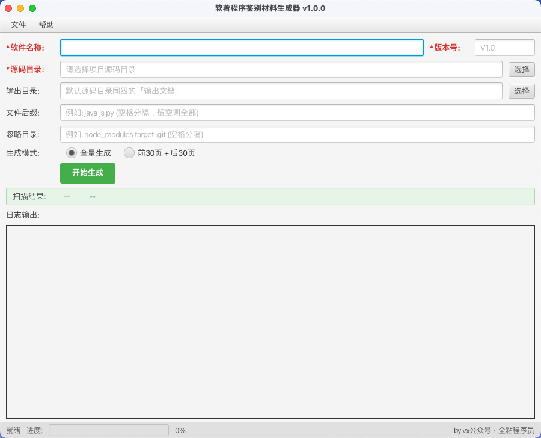
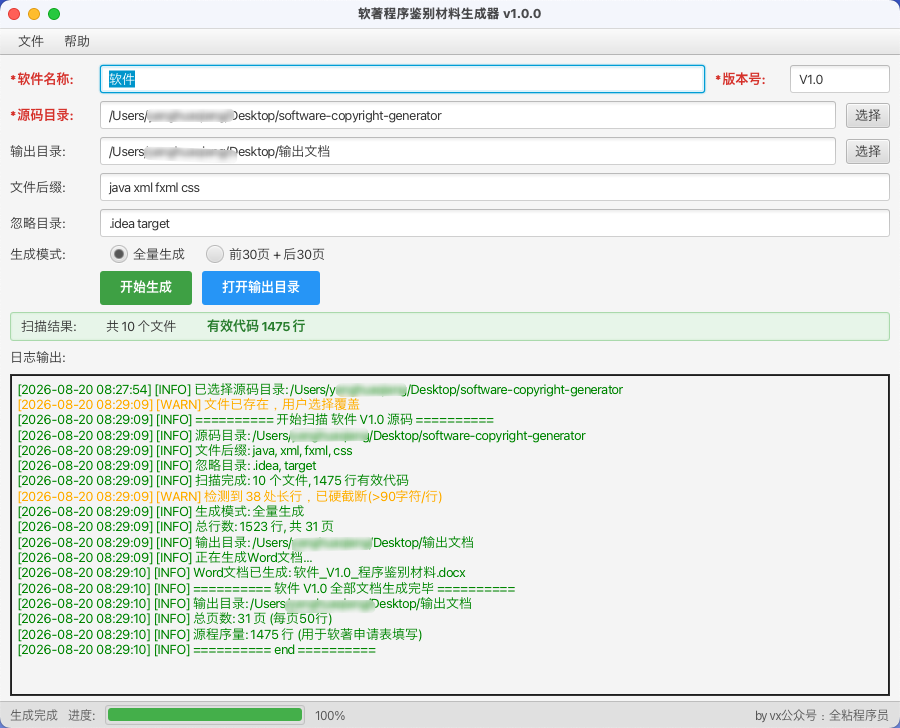
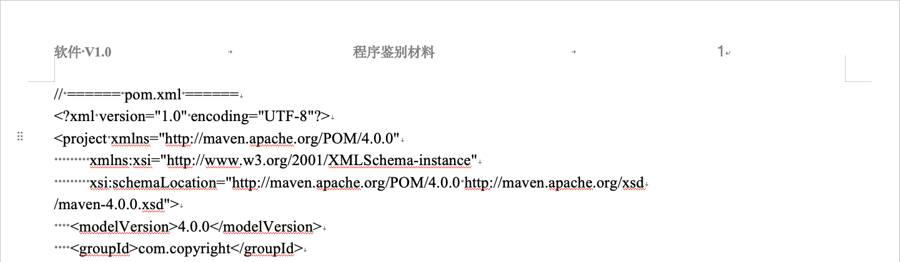

  

# 软著程序鉴别材料生成器

一个用来**申请计算机软件著作权**的小工具。自动扫描项目源码，生成符合**中国版权保护中心**要求的程序鉴别材料 Word 文档，无需手工排版。

> 本仓库发布工具介绍与安装包，不含源代码。

## 下载

| 平台                   | 安装包                                                                                                      |
| -------------------- | -------------------------------------------------------------------------------------------------------- |
| macOS（Apple Silicon） | [SoftwareCopyrightGenerator.dmg](https://github.com/y10111/software-copyright-generator/releases/latest) |
| Windows              | [SoftwareCopyrightGenerator.msi](https://github.com/y10111/software-copyright-generator/releases/latest) |

- Linux 版暂未发布。

- 前往 [Releases](https://github.com/y10111/software-copyright-generator/releases) 查看全部历史版本与更新说明。

## 功能

- 递归扫描源代码目录，支持按文件扩展名过滤、忽略指定目录

- 两种生成模式：

  - **全量生成** — 输出全部代码

  - **前30页+后30页** — 自动提取前 1500 行与后 1500 行，满足软著申请最低要求

- 输出 Word（.docx）文档，格式规范：

  - 每页精确 **50 行代码**，五号宋体（10.5pt），英文/数字 Times New Roman

  - 页眉：软件名称+版本号 / 程序鉴别材料 / 页码

  - 页脚：页码 of 总页数（X of Y）

  - A4 纸张，自动过滤空行，超长行智能截断防溢出

- 一键打开输出目录（macOS Finder / Windows 资源管理器）

## 软件截图

## 使用说明

1. 输入软件名称和版本号（必填，用于页眉）
2. 选择源代码目录（必填）
3. 选择输出目录（可选，默认在源码同级创建「输出文档」）
4. 输入文件后缀，空格分隔（如 `java js py`，留空则扫描全部文件）
5. 输入忽略目录，空格分隔（如 `node_modules target .git`）
6. 选择生成模式：全量生成 / 前30页+后30页
7. 点击「开始生成」

## 常见问题

- **安装包打开后被杀毒软件误报？** 请以管理员身份运行安装，或将程序加入信任列表后重试。

- **生成的文档会不会带脚本？** 本软件生成的 .docx 不含任何宏或脚本，可放心使用。

## 支持

如果这个工具帮到了你，欢迎请作者喝杯咖啡\~

## License

本项目遵循 MIT License 发布。
